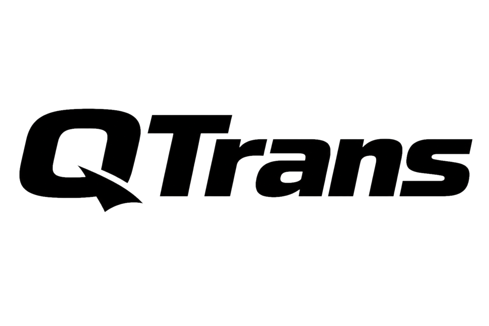
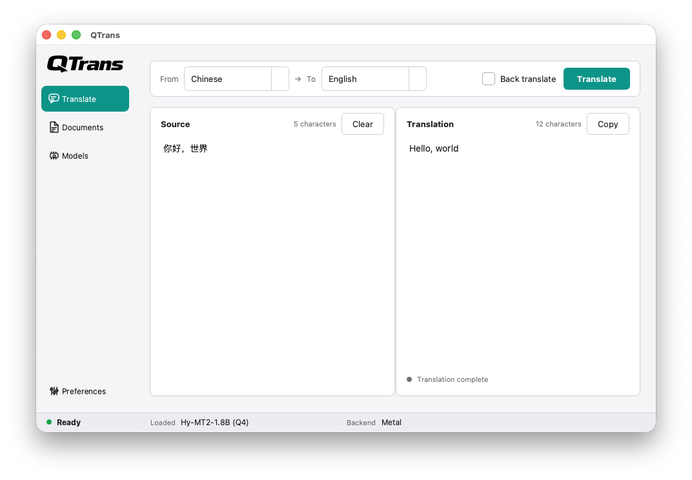

<p align="center">
  
</p>

<p align="center">
  <strong>An LLM translator for local models with built-in model downloads, GPU inference (Vulkan on Windows x64, Metal on macOS ARM64), word selection translation, batch file translation, and a local OpenAI-compatible API.</strong>
</p>

<p align="center">
  <a href="docs/README_zh.md">中文说明</a>
</p>

<p align="center">
  <a href="https://en.cppreference.com/w/cpp/17"></a>
  <a href="https://cmake.org/"></a>
  <a href="LICENSE"></a>
</p>

## Features

- Translate and back-translate
- Built-in model download and management
- Word selection translation: select text in any app, press a global hotkey, and read the translation in a popup
- Batch file translation for `.txt`, `.md`, and `.srt` with queueing, pause/resume, and saved outputs
- Local OpenAI-compatible API (`/v1/models`, `/v1/chat/completions`) to serve the loaded model to other tools

## Screenshot

<p align="center">
  
</p>

## Download

Prebuilt binaries are available on the [Releases](https://github.com/touken928/QTrans/releases) page:

- `QTrans-<version>-macos-arm64` — macOS ARM64
- `QTrans-<version>-windows-x64.zip` — Windows x64 (`QTrans.exe`, clang-cl with the MSVC static runtime)
Download the archive for your platform. On Windows, unzip and run `QTrans.exe`. On macOS, make the app executable if needed, then run it. On first launch, open **Model**, download the model, and click **Load**. Default model: **Q4** on all supported platforms. App data is stored under `~/.qtrans/` in system mode; batch queue state persists under `~/.qtrans/batch/`, and translated batch outputs are written to `~/.qtrans/batch/output/`.

## Build from Source

### Prerequisites

- [Conan 2](https://conan.io/) 2.28+
- CMake 3.31+, Ninja
- macOS: `brew install ninja pkg-config autoconf autoconf-archive automake libtool`
- Windows: Visual Studio C++ build tools and LLVM (`clang-cl`, `lld-link`; run from a Developer shell)

### Build

```bash
# macOS ARM64 (Release)
export CONAN_WORKSPACE_ENABLE=will_break_next
conan profile detect --force
conan install app --profile:host conan/profiles/macos-arm64-release --profile:build default \
  --lockfile conan/locks/macos-arm64-release.lock \
  -c:b tools.cmake.cmaketoolchain:generator=Ninja \
  --settings:build compiler.cppstd=17 \
  --output-folder build/arm64-osx-release/conan --build missing
conan build libs/sentbreak --profile:host conan/profiles/macos-arm64-release --profile:build default
cmake -S app --preset arm64-osx-release
cmake --build build/arm64-osx-release

# Windows clang-cl x64 (Release, MSVC ABI, Vulkan GPU, static CRT/dependencies)
set CONAN_WORKSPACE_ENABLE=will_break_next
conan profile detect --force
conan install app --profile:host conan/profiles/windows-x64-clangcl-release --profile:build default ^
  --lockfile conan/locks/windows-x64-release.lock ^
  -c:b tools.cmake.cmaketoolchain:generator=Ninja ^
  --settings:build compiler.cppstd=17 ^
  --output-folder build/x64-clangcl-static-release/conan --build missing
conan build libs/sentbreak --profile:host conan/profiles/windows-x64-clangcl-release --profile:build default
cmake -S app --preset x64-clangcl-static-release
cmake --build build/x64-clangcl-static-release

```

When you change dependencies (`app/conanfile.py`, `conanws.yml`, or a profile), refresh the matching lockfile and commit it:

```bash
# macOS ARM64 (Release)
export CONAN_WORKSPACE_ENABLE=will_break_next
conan lock create app --profile:host conan/profiles/macos-arm64-release --profile:build default \
  --lockfile-out conan/locks/macos-arm64-release.lock

# Windows clang-cl x64 (Release, MSVC ABI)
set CONAN_WORKSPACE_ENABLE=will_break_next
conan lock create app --profile:host conan/profiles/windows-x64-clangcl-release --profile:build default ^
  --lockfile-out conan/locks/windows-x64-release.lock
```

The supported build targets are macOS ARM64 with Clang and Windows x64 with clang-cl and lld-link. The Windows profile uses Conan's `msvc` compiler model because clang-cl emits the MSVC ABI. Windows artifacts statically link compatible third-party libraries and the MSVC C/C++ runtime; normal Windows system DLL imports remain.

## Development

See the [中文说明](docs/README_zh.md) for project usage and development notes.

## Project Layout

- `app/` - main Conan consumer and CMake project; the formal build target is `QTrans`
- `app/src/runtime/` - runs the model
- `app/src/translate/` - one translation: jobs, `InferenceService`, local API
- `app/src/download/` - model files: catalog, curl, checksum, which backend
- `app/src/batch/` - file queue
- `app/src/popup/` - word selection: hotkeys, clipboard, popup session
- `app/src/ui/` - windows: main window, pages
- `app/src/settings/`, `app/src/paths/`, `app/src/logging/` - leaves
- `app/tests/` - unit tests; they compile the shared source lists directly
- `libs/` - repository-owned Conan packages declared explicitly in `conanws.yml`

## License

[GPL-3.0](LICENSE)
