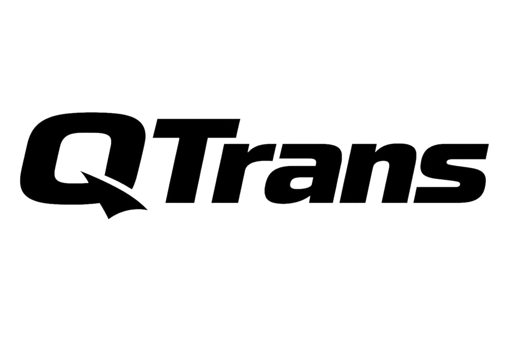
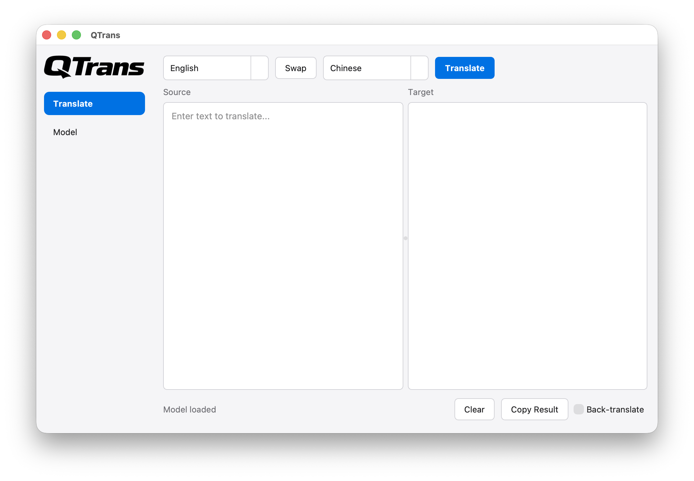

<p align="center">
  
</p>

<p align="center">
  <strong>在本机运行 <a href="https://huggingface.co/AngelSlim/Hy-MT2-1.8B-1.25Bit-GGUF">Hy-MT</a> 翻译模型的 LLM 软件，可自动下载权重并在 CPU 上完成推理。</strong>
</p>

<p align="center">
  <a href="../README.md">English</a>
</p>

<p align="center">
  <a href="https://en.cppreference.com/w/cpp/17"></a>
  <a href="https://cmake.org/"></a>
  <a href="../LICENSE"></a>
</p>

## 功能

- 翻译与回译
- 内置模型下载与管理
- 划词翻译（鼠标悬停 / 剪贴板捕获）

## 截图

<p align="center">
  
</p>

## 下载

预编译二进制可在 [Releases](https://github.com/touken928/QTrans/releases) 页面获取：

- `QTrans-<版本>-macos-arm64` — macOS ARM64
- `QTrans-<版本>-mingw-x64.exe` — Windows x64

下载对应平台的文件，在 macOS 上如需请先赋予可执行权限，然后运行。首次使用请打开 **Model** 页面下载模型，再点击 **Load**。

## 从源码构建

### 环境要求

- [vcpkg](https://vcpkg.io/)（设置 `VCPKG_ROOT`）
- CMake 3.21+、Ninja
- macOS：`brew install ninja pkg-config autoconf autoconf-archive automake libtool`
- Windows：MinGW 工具链（如 [llvm-mingw](https://github.com/mstorsjo/llvm-mingw)）需要加入 `PATH`

### 构建

```bash
# macOS ARM64（Release）
cmake --preset arm64-osx-release
cmake --build --preset arm64-osx-release

# Windows MinGW x64（Release）
cmake --preset x64-mingw-release
cmake --build --preset x64-mingw-release

# Debug（任意平台，使用 VCPKG_DEFAULT_TRIPLET）
cmake --preset default
cmake --build --preset debug
```

每个 preset 已内置 triplet，如需覆盖可设置 `VCPKG_DEFAULT_TRIPLET` 环境变量。

### clangd

使用 `default` preset 配置后可生成 `compile_commands.json` 供 clangd 使用：

```bash
cmake --preset default
```

## 许可证

[GPL-3.0](../LICENSE)
