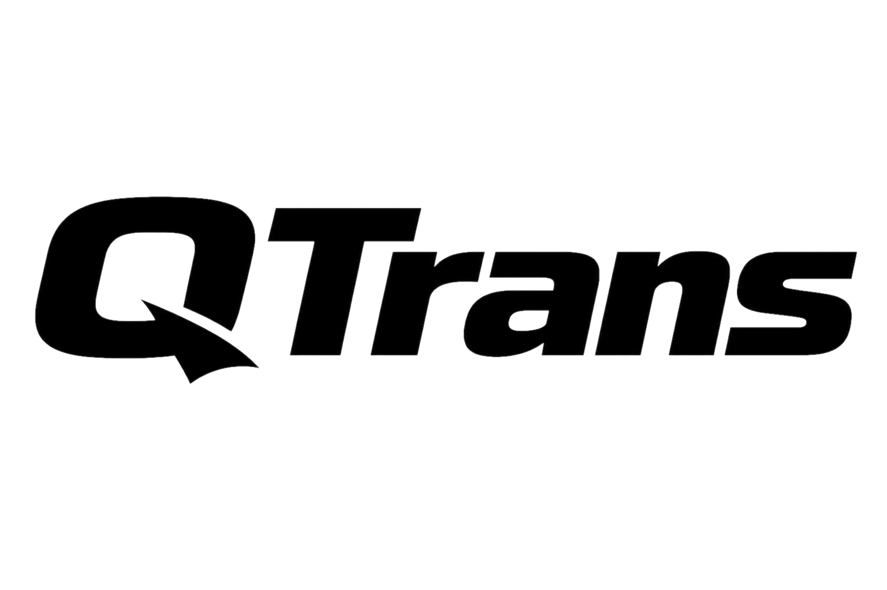
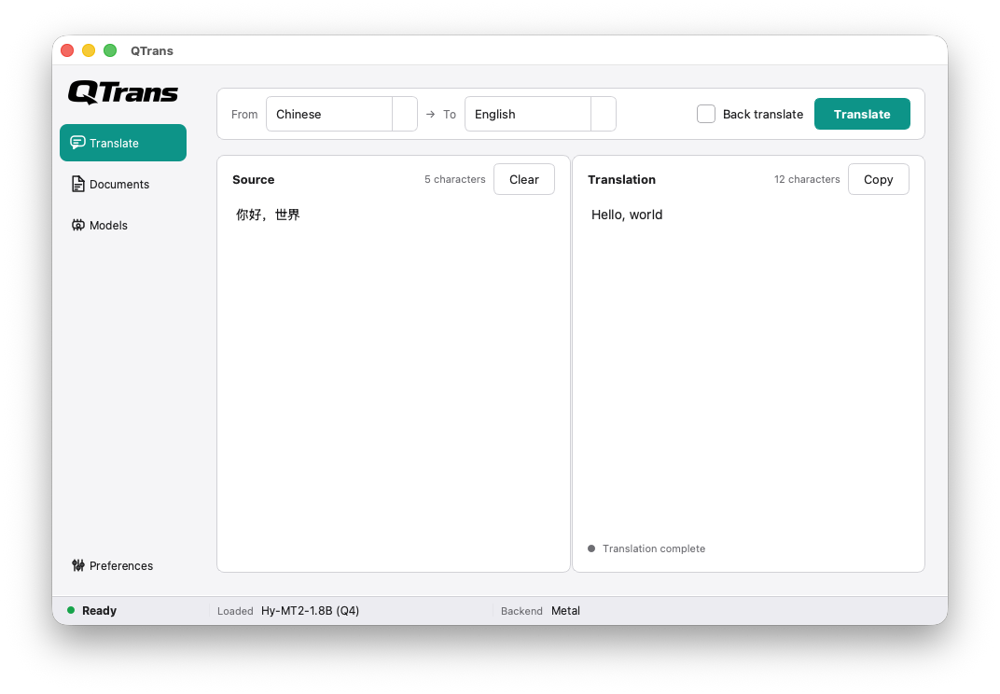

<p align="center">
  
</p>

<p align="center">
  <strong>在本机运行 <a href="https://huggingface.co/tencent/Hy-MT2-1.8B-GGUF">Hy-MT</a> 翻译模型的 LLM 软件，可自动下载权重；GPU 推理后端静态链入（Windows x64 为 Vulkan，macOS ARM64 为 Metal）。</strong>
</p>

<p align="center">
  <a href="../README.md">English</a>
</p>

<p align="center">
  <a href="https://en.cppreference.com/w/cpp/17"></a>
  <a href="https://cmake.org/"></a>
  <a href="../LICENSE"></a>
</p>

## 功能

- 翻译与回译
- 内置模型下载与管理
- 划词翻译（在任意应用中选中文字，按下全局快捷键，在弹出窗口中查看译文）
- 批量文件翻译（支持 `.txt` / `.md` / `.srt`，可排队、暂停/恢复，译文输出到 `batch/output/`）
- 本地 OpenAI 兼容 API（`/v1/models`、`/v1/chat/completions`，供其他工具调用已加载模型）

## 截图

<p align="center">
  
</p>

## 下载

预编译二进制可在 [Releases](https://github.com/touken928/QTrans/releases) 页面获取：

- `QTrans-<版本>-macos-arm64` — macOS ARM64
- `QTrans-<版本>-windows-x64.zip` — Windows x64（`QTrans.exe`，MSVC 静态运行时）
下载对应平台的压缩包。Windows 解压后直接运行 `QTrans.exe`；macOS 上如需请先赋予可执行权限，然后运行。首次使用请打开 **Model** 页面下载模型，再点击 **Load**。默认模型为 **Q4**。

## 从源码构建

### 环境要求

- [Conan 2](https://conan.io/) 2.28+
- CMake 3.31+、Ninja
- macOS：`brew install ninja pkg-config autoconf autoconf-archive automake libtool`
- Windows：Visual Studio 2022 C++ 构建工具（在 Developer shell 中执行）

### 构建

```bash
# macOS ARM64（Release）
export CONAN_WORKSPACE_ENABLE=will_break_next
conan profile detect --force
conan install app --profile:host conan/profiles/macos-arm64 --profile:build default \
  -c:b tools.cmake.cmaketoolchain:generator=Ninja \
  --settings:build compiler.cppstd=17 \
  --output-folder build/arm64-osx-release/conan --build missing
cmake -S app --preset arm64-osx-release
cmake --build build/arm64-osx-release
# 产物：build/arm64-osx-release/src/desktop/QTrans

# Windows MSVC x64（Release，Vulkan GPU，静态 CRT/依赖）
set CONAN_WORKSPACE_ENABLE=will_break_next
conan profile detect --force
conan install app --profile:host conan/profiles/windows-x64-static --profile:build default ^
  -c:b tools.cmake.cmaketoolchain:generator=Ninja ^
  --settings:build compiler.cppstd=17 ^
  --output-folder build/x64-msvc-static-release/conan --build missing
cmake -S app --preset x64-msvc-static-release
cmake --build build/x64-msvc-static-release
# 产物：build/x64-msvc-static-release/src/desktop/QTrans.exe

```

目前仅支持 macOS ARM64 Clang 和 Windows MSVC x64 构建。MSVC 产物静态链接第三方库及 C/C++ 运行时，只保留正常的 Windows 系统 DLL 导入。

## 开发

参与贡献、分支规范、CI、发版等说明请参考仓库中的 workflow 配置和 README。

## 许可证

[GPL-3.0](../LICENSE)
